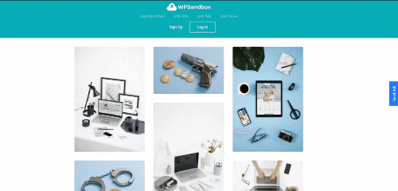

# Floating Facebook Page Plugin
Some essential stuffs for oxygen builder.




## Tutorial
1. Go to [https://developers.facebook.com/docs/plugins/page-plugin/](https://developers.facebook.com/docs/plugins/page-plugin/).
2. Add Facebook Page URL.
3. Click `Get Code`.
4. Click `IFrame` → Select your APP ID → Copy the code and save it for later use.
5. Go to Oxygen → Templates → Add New Reusable Part. 
6. Add title `Floating FB page plugin` or anything you want.
7. Click on ``Shortcodes`` and insert:
    
    ```
    [ct_code_block ct_sign_sha256='77a1dff29f1c1bd4ab286f1f538073dbc83f785d53f972f8b4f6d856a63dff39' ct_options='{"ct_id":1,"ct_parent":0,"selector":"code_block-44-8","original":{"code-php":"PGRpdiBjbGFzcz0iZmItcGFnZS1idG4tZHJhd2VyIj5GYWNlYm9vazwvZGl2Pgo8aWZyYW1lIHNyYz0iaHR0cHM6Ly93d3cuZmFjZWJvb2suY29tL3BsdWdpbnMvcGFnZS5waHA/aHJlZj1odHRwcyUzQSUyRiUyRnd3dy5mYWNlYm9vay5jb20lMkZSZWFsT3h5Z2VuQnVpbGRlciZ0YWJzPXRpbWVsaW5lJndpZHRoPTM0MCZoZWlnaHQ9NTAwJnNtYWxsX2hlYWRlcj1mYWxzZSZhZGFwdF9jb250YWluZXJfd2lkdGg9dHJ1ZSZoaWRlX2NvdmVyPWZhbHNlJnNob3dfZmFjZXBpbGU9dHJ1ZSZhcHBJZD02MzQ5Mjk5MTA0NTA1NjkiIHdpZHRoPSIzNDAiIGhlaWdodD0iNTAwIiBzdHlsZT0iYm9yZGVyOm5vbmU7b3ZlcmZsb3c6aGlkZGVuIiBzY3JvbGxpbmc9Im5vIiBmcmFtZWJvcmRlcj0iMCIgYWxsb3dmdWxsc2NyZWVuPSJ0cnVlIiBhbGxvdz0iYXV0b3BsYXk7IGNsaXBib2FyZC13cml0ZTsgZW5jcnlwdGVkLW1lZGlhOyBwaWN0dXJlLWluLXBpY3R1cmU7IHdlYi1zaGFyZSI+PC9pZnJhbWU+","code-css":"LmZiLXBhZ2UtYnRuLWRyYXdlcnsKCXBvc2l0aW9uOiBhYnNvbHV0ZTsKICAgIGxlZnQ6IC04MnB4OwogICAgaGVpZ2h0OiA1MHB4OwogICAgYm90dG9tOiA1MCU7CiAgICB0cmFuc2Zvcm06IHJvdGF0ZSgtOTBkZWcpOwogICAgcGFkZGluZzogMTBweCAyMHB4OwogICAgYmFja2dyb3VuZC1jb2xvcjogIzIzNzdmZjsKICAgIGNvbG9yOiAjZmZmOwogICAgbWFyZ2luOiBhdXRvIDA7CiAgICBjdXJzb3I6IHBvaW50ZXI7CiAgICB6LWluZGV4OiAxOwp9CgouZmItcGFnZXsKIAlwb3NpdGlvbjogZml4ZWQ7CiAgICB6LWluZGV4OiAxMDsKICAgIHJpZ2h0OiAtMzUwcHg7CiAgICBiYWNrZ3JvdW5kLWNvbG9yOiAjZjRmNGY0OwogICAgdHJhbnNpdGlvbi1kdXJhdGlvbjogMC4zczsKICAgIHRyYW5zaXRpb24tdGltaW5nLWZ1bmN0aW9uOiBlYXNlOwogICAgdHJhbnNpdGlvbi1wcm9wZXJ0eTogcmlnaHQ7CiAgICB0cmFuc2l0aW9uLWRlbGF5OiAwLjFzOwogICAgdG9wOiBhdXRvOwogICAgYm90dG9tOiBhdXRvOwogICAgbWFyZ2luLXRvcDogYXV0bzsKICAgIG1hcmdpbi1ib3R0b206IGF1dG87CiAgICBib3gtc2hhZG93OiAwcHggMnB4IDVweCA0cHggI2E1YTVhNTsgCiAgCWRpc3BsYXk6IGJsb2NrOwp9CgouZmItcGFnZTpob3ZlcnsKICAJcmlnaHQ6IDBweDsKfQ==","code-js":"alF1ZXJ5KGRvY3VtZW50KS5yZWFkeShmdW5jdGlvbigkKSB7CiAgCiAgJCgnLmZiLXBhZ2UtYnRuLWRyYXdlcicpLm9uKCdjbGljaycsIGZ1bmN0aW9uKCkgewogICAgCiAgICBpZiggJCgnLmZiLXBhZ2UnKS5jc3MoJ3JpZ2h0JykgPT0gJzBweCcgKSB7CiAgICAgIAogICAgICAJJCgnLmZiLXBhZ2UnKS5jc3MoeydyaWdodCcgOiAnLTM1MHB4JyB9KTsKCiAgICB9IGVsc2UgewogICAgICAKICAgICAgCSQoJy5mYi1wYWdlJykuY3NzKHsncmlnaHQnIDogJzBweCcgfSk7CgogICAgfQogICAgICAgICAgICAKICAgfSk7Cn0p"},"classes":{"0":"fb-page"},"activeselector":"fb-page"}'][/ct_code_block]
    ```
    
8. Publish.
9. Click `Edit with Oxygen`.
10. Go to the Code Block setting, Click PHP & HTML.
11. You can see the codeline ``<div class="fb-page-btn-drawer">Facebook</div>`` and the iframe code below.
12. Change the FB iframe code by removing it and pasting the new one that we save earlier. Click `Save` and close the editor.
13. Go to your Page, Add → Reusable → `Floating FB page plugin`.
15. Done.
